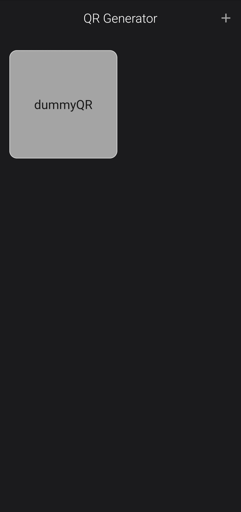
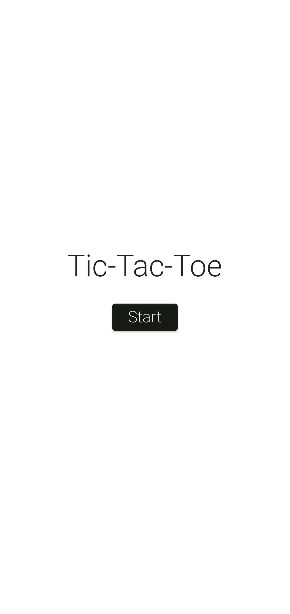
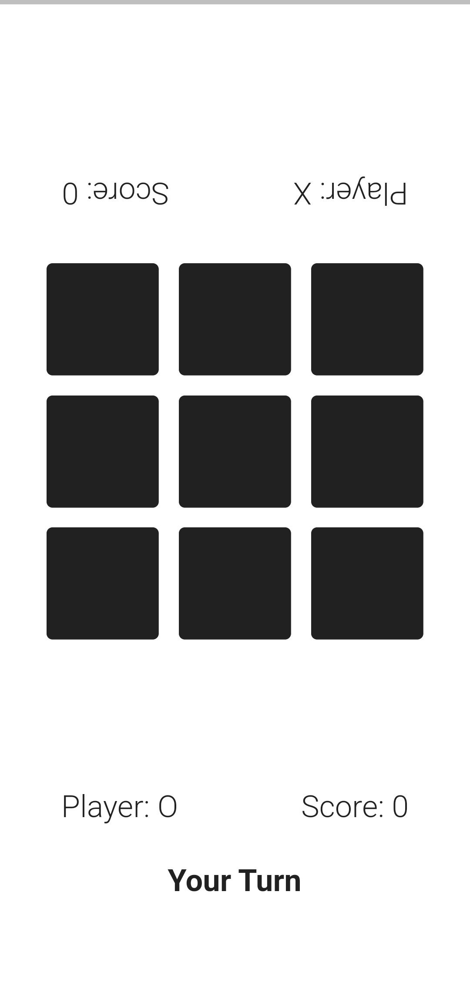
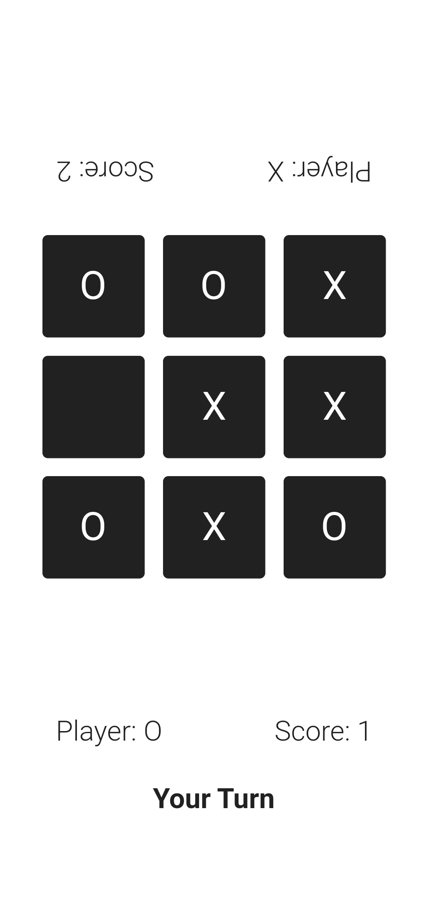
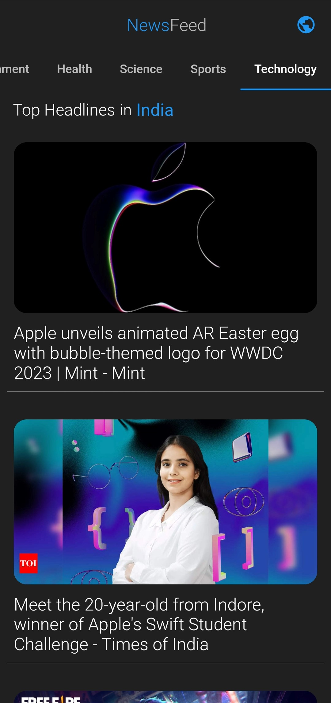

<h1 align="center">
News Feed
</h1>

<h6 align='right'><a href = 'https://github.com/nishanth1000/TicTacToe-FlutterApp/releases/download/v0.1.1/tictactoe.apk'>Download the App </a></h6>

• A Mobile Application designed to deliver news content. 
• A single app which can deliver all the news content across 54 countries. 
• Displays the news article using the url specified for the news.

## Features
• News content across 54 countries. 
• Quick change of news content between countries. 
• News contents are subcategorized into <h3>General, Business, Entertainment, Health, Science, Sports, Technology</h3>. 
• By default the country is set to India. 

## Screenshots
#### Fetching Data from API
<pre>
 
</pre>

#### Default Country's News - India
<pre>
      
</pre>
