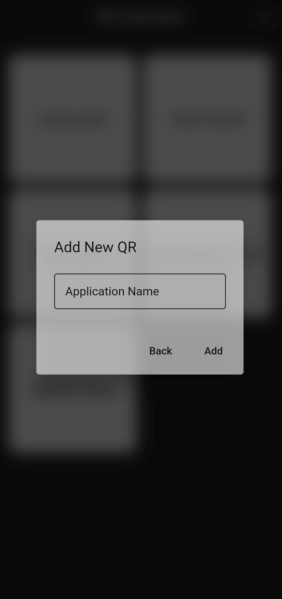

<h1 align="center">
QR Generator
</h1>

<h6 align='right'><a href = 'https://github.com/nishanth1000/TicTacToe-FlutterApp/releases/download/v0.1.1/tictactoe.apk'>Download the App </a></h6>

## Features
• Create QR Code for a . 
• Stores all QR Codes in local storage. 

## Screenshots
#### Home Screen
<pre>
 
</pre>

#### Add QR Code to local storage
<pre>

</pre>

#### Delete QR Code (On Long Press of particular QR Code)
<pre>

</pre>

#### View QR Code (On Tap of particular QR Code)
<pre>
 
</pre>

